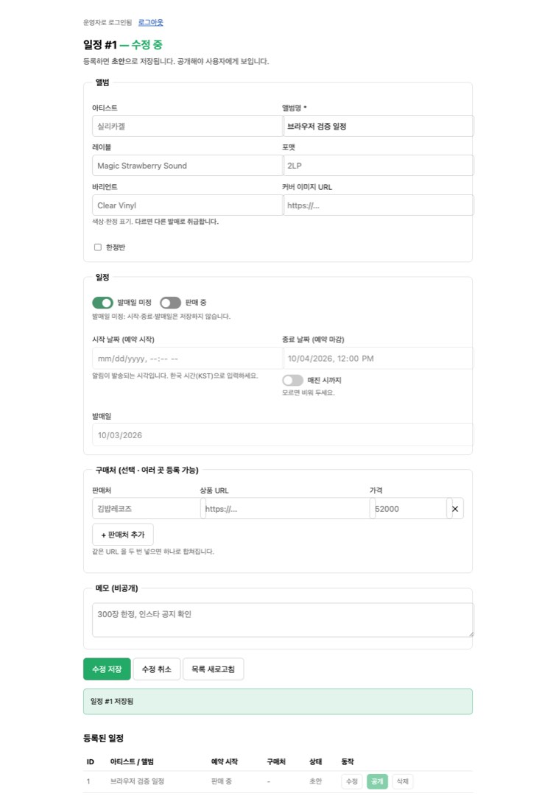

# 운영자 일정 토글 변경·검증

2026-09-14. T-109 운영자 폼 개선 및 관련 API·표시 일관성 수정.

| 선택 | 시작 날짜 | 종료 날짜 | 별도 발매일 |
|---|---|---|---|
| 날짜 직접 입력 | 입력 가능 | 선택 | 선택 |
| 발매일 미정 | 비활성 | 비활성 | 비활성 |
| 판매 중 | 비활성 | 선택 | 선택 |
| 매진 시까지 | 다른 선택에 따름 | 비활성 | 다른 선택에 따름 |

‘발매일 미정’과 ‘판매 중’은 동시에 켤 수 없다. ‘발매일 미정’에서는 ‘매진 시까지’도 비활성화하고 저장 시 false로 정규화한다. ‘판매 중 + 매진 시까지’ 조합은 가능하다.

날짜를 입력한 다음 토글을 켜도 비활성 입력은 저장하지 않는다. 같은 편집 중 토글을 다시 끄면 입력값을 재사용할 수 있지만, 저장하면 제외한 날짜는 null이 된다. 다시 수정할 때 저장된 상태를 복원한다. 기존 일정은 SCHEDULED/false 기본값으로 보존하며 날짜를 재해석하지 않는다.

‘판매 중’을 선택해도 가짜 시작 시간을 생성하지 않는다. ‘매진 시까지’는 종료 조건이며 매진 자동 감지 기능은 아니다. 정확한 시각이 없는 항목의 캘린더 이벤트를 임의로 만들지 않는다. 공개 웹·모바일 목록과 상세에 상태를 표시한다.

## 적용

- DB revision `c3d6a8f02491`: schedule_status / until_sold_out 추가, 모순된 상태를 막는 CHECK 제약. 기존 DB에 추가형 마이그레이션 적용.
- API: 소스 리로드로 운영자 폼과 POST/PATCH 처리 반영. 공개 응답과 OpenAPI 및 모바일 생성 타입 갱신.
- 웹: 상태 표시 변경을 production 이미지 `7b5fce1d312b`에 반영하고 웹 컨테이너 교체. 이전 이미지는 `orot-web:before-schedule-modes`로 보존.
- 모바일: JavaScript 변경이므로 개발 앱에서 Fast Refresh/새로고침으로 반영. native 모듈 변경 없음.

## 검증

- Python lint·mypy/core strict 통과, pytest 427 passed / 2 xfailed. 기존 Starlette/httpx 경고 1개.
- 웹 lint·production build 통과, node 테스트 24개 통과.
- 모바일 lint·typecheck 통과, 4 suites / 13 tests 통과. Expo 호환 검사 및 doctor 20/20 통과.
- PostgreSQL 격리 스키마에서 POST/PATCH 저장, 상태 전환, 상태 생략 시 보존, 이전 날짜 이벤트 무효화, 공개 직렬화 검사 후 전체 롤백.
- 새 마이그레이션 upgrade/downgrade/upgrade를 별도의 격리 스키마에서 확인 후 롤백. 기존 날짜와 제약 이름 확인.
- Chromium headless에서 실제 폼 HTML로 상호 배타 토글·비활성 입력·등록/수정 요청·편집 복원·초기화 확인. 모든 브라우저 API 요청은 mock 처리.
- 배포 후 API health·운영자 토글 HTML·localhost 및 Funnel feed 응답 확인. 당시 공개 일정 5건에 상태 필드가 포함되고 notes는 없음. API/DB healthy, collector 실행 유지.
- 아래 이미지는 가짜 API를 사용하는 브라우저 검증 화면이며 실제 운영 일정이 아니다. 운영 DB에 테스트 일정을 등록하거나 푸시를 발송하지 않았다. Simulator는 이번 검증에서 실행하지 않았다.

[UI 실시간 수정 안내](UI_DEVELOPMENT.ko.md)
