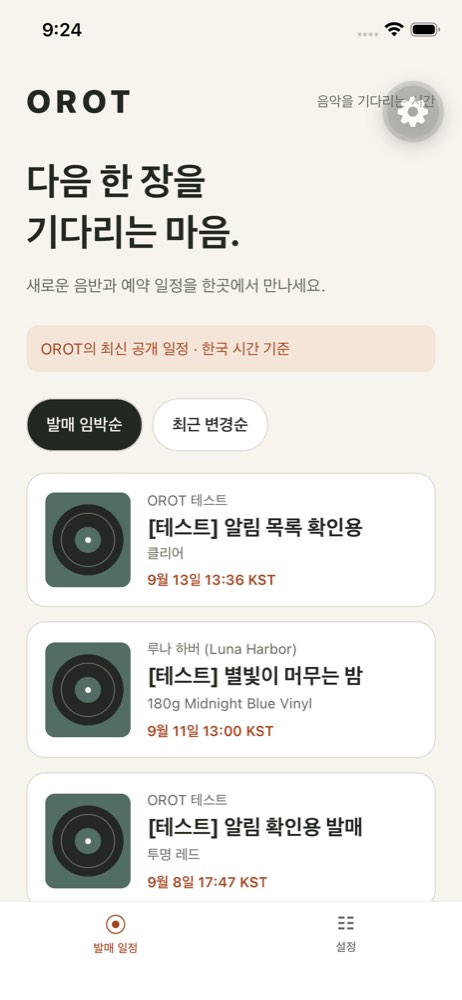

# T-033 — 실제 서비스 연결 검증

검증일: 2026-09-13. 모바일 읽기 API 연결과 웹 배포까지의 기록이다. T-033 전체 완료 또는 App Store 배포 완료를 뜻하지 않는다.

## 연결 구조와 공개 범위

```text
Expo 앱 → HTTPS Funnel → Next.js :3000 → 내부 FastAPI :8000 → PostgreSQL
개발 JavaScript → Mac의 Metro :8081 (Funnel과 별도)
```

기본 API 주소는 `https://jaehyeonui-macmini.tail598a5f.ts.net/api/mobile`이다. `.env`를 새로 만들 필요 없이 연결된다. 서버가 꺼지면 앱의 최신 일정 조회도 실패한다.

사용자가 명시적으로 승인한 다음 GET 경로를 배포했다.

| 공개 경로 | 동작 |
|---|---|
| `/api/mobile/v1/feed` | 공개 일정, 최대 100건, imminent/recent 정렬 |
| `/api/mobile/v1/releases` | 공개 목록, 기존 cursor와 필터 |
| `/api/mobile/v1/releases/{id}` | 공개 상세와 판매처 링크 |

기존 공개 API의 제목·아티스트·예약/발매일·판본·이미지 URL·판매처 링크/가격을 전달한다. 공개 API는 초안을 제외하고 운영자 메모를 응답 스키마에 포함하지 않는다. 관리자·기기 등록·쓰기·임의 URL 프록시는 추가하지 않았다. API와 DB 포트는 계속 loopback에 바인딩한다.

프록시는 허용된 경로·쿼리만 처리하고 인증 헤더/쿠키를 전달하지 않는다. upstream redirect를 거부하고 10초 제한, 응답 4 MiB 상한, no-store를 적용한다. 모바일 요청은 12초 제한과 런타임 데이터 검증을 적용한다.

## 앱 변경

- 실행 화면의 mock 데이터를 제거하고 피드·상세를 서버에서 조회한다. 테스트 fixture는 tests에만 둔다.
- 정렬, 당겨서 새로고침, 로딩·빈 목록·실패·재시도·없는 상세 안내를 제공한다.
- 이전 요청이 늦게 완료되어 새 정렬 결과를 덮어쓰지 않도록 취소와 응답 무시를 처리한다.
- 커버 URL을 렌더링하고 실패하면 레코드 그래픽을 표시한다. 유효한 HTTP(S) 판매처 링크와 가격을 표시한다.
- 모바일 API 타입은 저장소 OpenAPI에서 생성한다. 모바일 푸시 등록은 아직 구현하지 않았다.
- 피드는 최대 100건이며 무한 스크롤이나 오프라인 저장을 제공하지 않는다.

## 배포와 실제 확인

웹 교체 전 이미지를 `orot-web:before-mobile-read`로 보존했다. 다음 명령으로 웹만 빌드·교체했다. Docker context에서 apps/mobile을 제외했다.

```sh
cd /Users/jaehyeon/PersonalProjects/OROT
docker compose -f compose.yaml -f compose.prod.yaml build web
docker compose -f compose.yaml -f compose.prod.yaml up -d --no-deps web
```

검증 기준 소스는 `ca7a982` 이후 작업 트리이며, 배포 이미지 ID 접두사는 `ad28598e4699`다. 모바일 정리 및 검증 문서는 그 후 작업 트리 변경을 포함한다. 웹의 재빌드와 모바일 JS 갱신은 별도 작업이다.

| 검증 | 결과 |
|---|---|
| 공개 HTTPS feed | 200, 당시 공개 일정 4건, notes 없음 |
| 공개 상세 ID 32 | 200, notes 없음 |
| releases?limit=1 | 200, next_cursor 반환 |
| feed에 url 쿼리 추가 | 400 |
| POST feed | 405 |
| 모바일 admin / devices 경로 | 404 |
| 잘못된 상세 ID | 400 |
| Compose 상태 | web만 교체, API/DB healthy, collector 실행 유지 |
| Simulator | 실제 서버의 일정 제목과 KST 날짜 표시 확인 |

위 개수와 ID는 해당 시점의 관찰이며 향후 테스트 데이터 삭제 권한이나 고정 기대값이 아니다. 기존 DB 일정·구독은 수정하지 않았고 실제 푸시는 발송하지 않았다.



환경: macOS 26.5.1, Xcode 26.2, iOS 26.2의 OROT iPhone 14 Simulator, Node 22.23.2, Expo 55.0.31, React Native 0.83.10, React 19.2.0. 기존 development build에서 JS를 갱신했으며 이번 연결 변경에 native 재빌드는 필요하지 않았다. 화면 모서리의 개발 메뉴 버튼은 development build 표시다.

## 자동 검사

| 검사 | 결과 |
|---|---|
| 모바일 npm run check | lint·TypeScript 통과, 4 suites / 12 tests 통과 |
| 웹 lint 및 node tests | 통과, 23 tests |
| 웹 production build / Docker build | 통과 |
| make lint | Ruff·포맷·mypy 및 core strict 통과 |
| make test | 418 passed, 2 xfailed |

모바일 자동 테스트는 네트워크 없는 fixture로 피드→상세 이동, 404, 오류 후 재시도, 응답 검증, 요청 제한 시간, 안전한 판매처 URL, 날짜 표시, 요청 경쟁을 검사한다. 공개 HTTPS 수동 검증과 Simulator 화면 확인은 이 자동 테스트와 구분한다. Python의 기존 Starlette/httpx deprecation 경고와 robots.txt 관련 expected failure 2개는 남아 있다.

## 다시 실행하기

기존 Simulator 앱이 설치된 Mac에서:

```sh
cd /Users/jaehyeon/PersonalProjects/OROT/apps/mobile
npm exec --yes --package=node@22.23.2 -- npm run start:simulator
```

8081에 기존 Metro가 실행 중이면 해당 개발 터미널에서 Ctrl+C로 종료한 뒤 실행한다. 첫 실행의 Expo 안내는 Continue를 누른다. Simulator 앱의 발매 일정 탭에서 웹의 일정과 비교하고, 상세·판매처 링크·새로고침을 확인한다.

```sh
# API 계약이 바뀐 경우 루트에서 make openapi 실행 후 모바일 디렉터리에서:
npm run generate:api
npm run check

# 공개 연결을 읽기 전용으로 직접 확인:
curl --fail 'https://jaehyeonui-macmini.tail598a5f.ts.net/api/mobile/v1/feed?limit=1&sort=imminent'
```

다른 서버로 이동할 때만 `apps/mobile/.env`에 `EXPO_PUBLIC_API_BASE_URL=https://새호스트/api/mobile`을 설정하고 Metro를 재시작한다. 공개 환경 변수에 관리자 키나 비밀을 넣지 않는다. 이미 배포된 production 앱은 env 파일 수정만으로 바뀌지 않으므로 새 빌드 또는 별도로 검증한 업데이트가 필요하다.

## 남은 검증

iPhone 14 실기기 설치·서명·터치 동선, 실제 판매처 브라우저 열기, 모바일 푸시, Android 빌드, TestFlight/스토어 배포는 아직 검증하지 않았다. 상세 API는 실제 HTTPS로, 상세 이동은 Router 자동 테스트로 확인했으며 Simulator에서 상세를 직접 터치한 검증으로 간주하지 않는다.

다음 작업은 iPhone 14의 USB 신뢰·Developer Mode·Xcode Team을 설정해 development build를 설치하고, 같은 LAN의 Metro와 공개 Funnel API를 연결하여 목록·상세·판매처 링크를 확인하는 것이다. 실기기에서는 `npm start`를 사용하며 localhost 전용 `start:simulator`를 사용하지 않는다. 푸시 제공자와 설치 인증 계약은 ADR-0009의 후속 결정 범위다.
