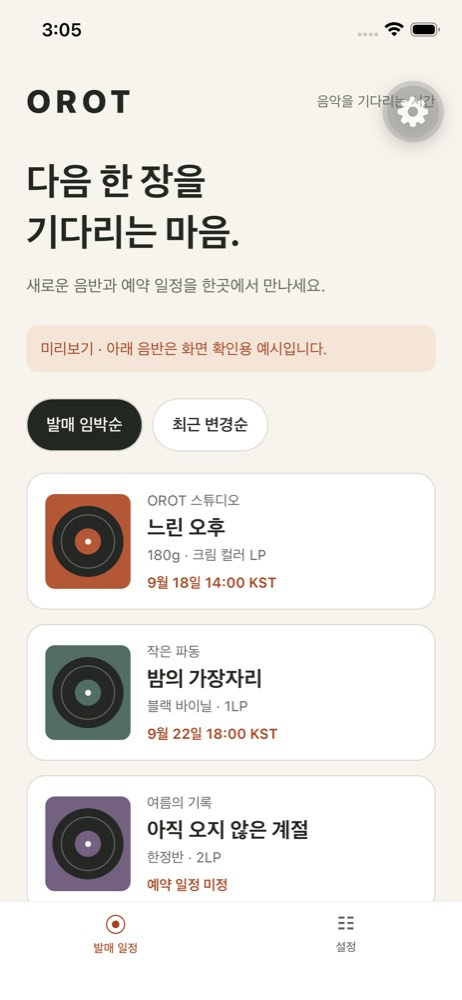

# T-033 첫 단계 — 모바일 앱 뼈대 검증

검증일: 2026-09-13. 범위는 환경 확인·mock 앱·로컬 Simulator 빌드다. T-033 전체 완료가 아니다.

> 후속 실제 API 연결·배포 결과는 [연결 검증](T-033-live-api.ko.md)을 참고한다. 아래는 연결 전 단계의 기록이다.

## 구현

- `apps/mobile`에 Expo Router, React Native, TypeScript strict 기반 앱 추가.
- 로컬 가상 음반 3개, 정렬 선택, 상세 이동·없는 상세 안내, 설정 탭.
- 앱 이름 OROT, 기존 OROT 아이콘 재사용. `com.orot.mobile.dev` / `orot-dev`는 개발용 식별자.
- 네트워크·푸시 없는 fixture 테스트, production EAS profile 거부, 독립 npm lockfile.
- `npm run start:simulator`에 IPv4 우선 localhost Metro 설정을 포함.
- 서버 코드·Docker·Funnel·DB·루트 .env는 변경하지 않았다. 공개 API 프록시와 모바일 푸시는 후속이다.

## 실제 확인한 환경

| 항목 | 값 |
|---|---|
| Mac | macOS 26.5.1, Apple Silicon |
| Xcode | 26.2 (17C52) |
| Simulator | 신규 OROT iPhone 14, iOS 26.2 (23C54) |
| Node | 시스템은 25.8.0 유지; 모바일 명령은 npm exec의 22.23.2 |
| CocoaPods | 1.17.0 신규 설치 |
| Expo / RN / React | 55.0.31 / 0.83.10 / 19.2.0 |
| Router / dev-client | 55.0.18 / 55.0.40 |
| jest-expo / RNTL | 55.0.22 / 13.3.3 |

Expo SDK 57은 Xcode 26.4+를 요구하므로 현재 Xcode에 맞는 SDK 55를 선택했다. [공식 SDK 지원표](https://docs.expo.dev/versions/latest/)

CocoaPods 설치 과정에서 Homebrew가 Ruby 4.0.6_1, ca-certificates를 설치/갱신했다. 실제 설치 상세는 Homebrew 기록을 따른다. 시스템 Node를 교체하거나 서버를 재시작하지 않았다. Expo 계정·유료 가입·EAS 원격 프로젝트·스토어 업로드는 수행하지 않았다.

## 검사 결과

| 검사 | 결과 |
|---|---|
| 기존 `make lint` | Ruff 및 mypy source/test 77개, core strict 21개 PASS |
| 기존 `make test` | 418 passed, 2 xfailed; 기존 Starlette/httpx deprecation 경고 1개 |
| `npm ci --offline` | lockfile 재설치 성공; 이후 모바일 검사 재통과 |
| 모바일 `npm run check` | lint·typecheck 및 2 suite / 10 tests PASS |
| `expo install --check` | SDK 호환 의존성 일치 |
| `expo-doctor` | 20/20 PASS |
| iOS native build | Build Succeeded, 0 errors / 3 warnings |
| Simulator 설치·실행 | OROT 앱 설치, Metro 번들 로드, mock 피드 시각 확인 |
| 상세·없는 상세·설정 | Router 자동 테스트 PASS; 실기기 결과 아님 |
| iPhone 14 실기기 | 미검증 — 기기 연결·서명 Team·Developer Mode 필요 |
| 실제 API·푸시·TestFlight·Android | 이번 단계 범위 밖, 미검증 |

화면 이동 링크의 style 배열을 Expo Router asChild 계약에 맞춰 flatten하고, 접근성 역할을 link로 맞췄다. KST 자정 경계, 날짜만 있는 값, unknown 날짜 정렬, 잘못된 route ID, 실제 네트워크 호출 방지를 검사했다.

아래는 Simulator에서 실제 로드된 피드다. 상단 톱니바퀴는 Expo 개발 메뉴이며 제품 화면 요소가 아니다.



## 확인된 제한과 후속 점검

1. **npm audit:** 설치 직후 19 moderate 항목. 핵심 원인은 `decode-uri-component`와 빌드 도구의 `uuid` 등 전이 의존성 경고다. expo-doctor 통과는 보안 감사 통과가 아니다. `npm audit fix --force`가 구형 Expo로의 비호환 변경까지 제안하므로 실행하지 않았다. 직접 override는 CommonJS/ESM 호환성과 native 빌드를 검증한 뒤 적용해야 한다. 공개 배포 전 SDK 업데이트와 함께 다시 점검한다. 최종 온라인 audit 재요청은 의존성 메타데이터 외부 전송을 이유로 자동 승인 검토에서 거부되어 수행하지 않았다. 수치는 앞서 확보한 감사 결과다. `npm ci --offline`의 0 vulnerabilities 출력은 최신 온라인 감사 결과로 간주하지 않는다.
2. **빌드 경고 3개:** 중복 `-lc++`, Expo Dev Launcher 스크립트의 dependency analysis 경고, SDWebImage pod deployment target 경고. 빌드는 성공했다. 생성된 Pods를 수기로 고쳐 재생성 시 사라지는 수정을 하지 않았다.
3. **Metro localhost:** 최초 IPv6 `::1`에만 listen하면서 manifest는 127.0.0.1을 가리켰다. `NODE_OPTIONS=--dns-result-order=ipv4first`로 해결하고 실행 스크립트에 반영했다.
4. **개발 앱 재연결:** 앱 launch 직후 개발 URL을 다시 열던 과정에서 native JSI teardown의 EXC_BAD_ACCESS가 1회 관찰되었다. 단독 재실행 후 피드 로드는 성공했다. 원인 확정이나 전체 안정성 검증 완료로 보지 않는다. 재현 여부를 다음 실기기/SDK 업데이트 때 확인한다. 실행 중인 앱에 development URL을 연속으로 열지 않는다.
5. **UI 검증 범위:** 라이트 피드는 캡처 확인. 큰 글자·다크 모드 전환은 실행했지만 상세 링크의 시스템 Open 확인창 때문에 해당 조합의 상세 시각 검증은 완료하지 못했다. macOS가 자동 키 입력을 허용하지 않아 임의로 접근성 권한을 변경하지 않았다. 상세 이동은 Router 테스트로 검증했으며 VoiceOver·물리적 탭·다크/큰 글자 전체 동선은 후속 수동 검증 대상이다.

## 다시 실행

[앱 README](../../apps/mobile/README.md)에 준비·실행·검사 명령이 있다. 기본 Node 25인 현재 Mac에서는 다음을 사용한다.

```sh
cd /Users/jaehyeon/PersonalProjects/OROT/apps/mobile
npm exec --yes --package=node@22.23.2 -- npm run start:simulator
```

8081을 사용하는 기존 Metro가 있으면 해당 개발 터미널에서 Ctrl+C 후 실행한다. 이미 열린 Simulator에서 Expo 안내가 나타나면 Continue로 닫는다. 앱은 개발 JS 서버가 필요하므로 Metro를 닫으면 새 로드가 실패할 수 있다. 서버 API용 Funnel과는 별개다.

## 다음 단계

T-033의 고정 공개 읽기 프록시·OpenAPI 기반 TypeScript 타입 생성·실제 API 연결. 그 다음 iPhone 14 실기기 UI 검증으로 진행한다. 푸시 제공자·익명 설치 인증은 ADR-0009 제안 상태를 유지한다.
